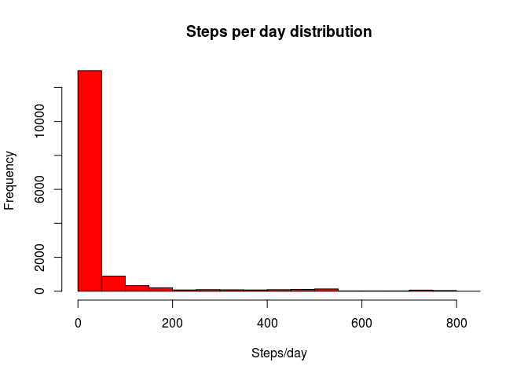
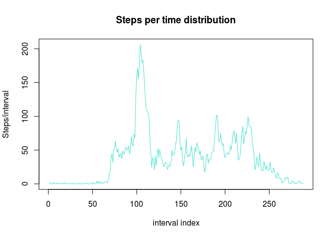
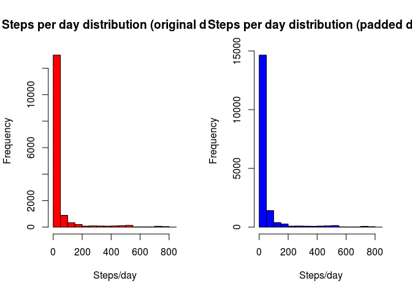
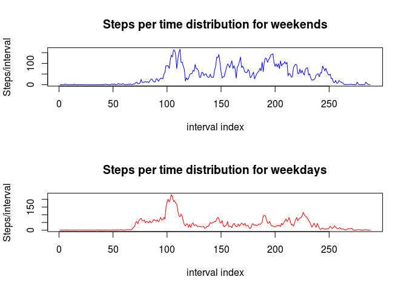

# Reproducible Research: Peer Assessment 1


## First we need to load data from attached archieve

```r
unzip("activity.zip")
data <- read.csv("activity.csv")
dataFiltered <- data[FALSE == is.na(data$steps), ]
dataFilteredOut <- data[TRUE == is.na(data$steps), ]
```


## Let's find out basic properties of steps per day (mean, median and distribution shape)]

```r
summary(dataFiltered$steps)
```

```
##    Min. 1st Qu.  Median    Mean 3rd Qu.    Max. 
##     0.0     0.0     0.0    37.4    12.0   806.0
```

```r
hist(
    dataFiltered$steps,
    col="red",
    main="Steps per day distribution",
    xlab="Steps/day",
    ylab="Frequency"
)
```

 

Here we see that overwelming majority of intervals have no stepping activity, and dependancy looks hyperbola-like
Average number of steps per interval is 37.4, and median is 0 (because more then 50% periods are perfectly idle)


## Let's find out average daily activity pattern and where max number of steps comes from

```r
stepsPerInterval <- tapply(dataFiltered$steps, dataFiltered$interval, mean)
plot(
    stepsPerInterval,
    col="turquoise",
    type="l",
    main="Steps per time distribution",
    xlab="interval index",
    ylab="Steps/interval"
)
```

 

```r
max(stepsPerInterval)
```

```
## [1] 206.2
```

```r
which.max(stepsPerInterval)
```

```
## 835 
## 104
```

Here we see that daily activity raises on ~65th interval, reaches maxmum at 206th interval and then decreases with few more peaks


## Let's measure a number and a share of items missing in dataset

```r
nrow(data) - nrow(dataFiltered)
```

```
## [1] 2304
```

```r
(nrow(data) - nrow(dataFiltered)) / nrow(data)
```

```
## [1] 0.1311
```

Original dataset misses number of steps for 2304 records, or 13% of total


## Let's pad data with missing items and check how output differs from original one

```r
getStepsPerInterval <- function(intervalIndex) stepsPerInterval[toString(intervalIndex)]
dataPad <- dataFilteredOut
dataPad$steps <- sapply(dataPad$interval, getStepsPerInterval)
dataPadded <- rbind(dataFiltered, dataPad)
par(mfrow=c(1, 2)) 
hist(
    dataFiltered$steps,
    col="red",
    main="Steps per day distribution (original data)",
    xlab="Steps/day",
    ylab="Frequency"
)
hist(
    dataPadded$steps,
    col="blue",
    main="Steps per day distribution (padded data)",
    xlab="Steps/day",
    ylab="Frequency"
)
```

 

```r
summary(dataFiltered$steps)
```

```
##    Min. 1st Qu.  Median    Mean 3rd Qu.    Max. 
##     0.0     0.0     0.0    37.4    12.0   806.0
```

```r
summary(dataPadded$steps)
```

```
##    Min. 1st Qu.  Median    Mean 3rd Qu.    Max. 
##     0.0     0.0     0.0    37.4    27.0   806.0
```

Here we see that padding original data set with replacing missing values with average of corresponding interval does not make a difference in distribution shape


## Let's find out difference in activity patterns for weekends and weekdays

```r
dataPadded$isWeekend <- weekdays(as.Date(dataPadded$date)) == "Sunday" | weekdays(as.Date(dataPadded$date)) == "Saturday"
dataWeekends <- dataPadded[dataPadded$isWeekend == TRUE, ]
dataWeekdays <- dataPadded[dataPadded$isWeekend == FALSE, ]
stepsPerIntervalWeekends <- tapply(dataWeekends$steps, dataWeekends$interval, mean)
stepsPerIntervalWeekdays <- tapply(dataWeekdays$steps, dataWeekdays$interval, mean)
par(mfrow=c(2, 1)) 
plot(
    stepsPerIntervalWeekends,
    col="blue",
    type="l",
    main="Steps per time distribution for weekends",
    xlab="interval index",
    ylab="Steps/interval"
)
plot(
    stepsPerIntervalWeekdays,
    col="red",
    type="l",
    main="Steps per time distribution for weekdays",
    xlab="interval index",
    ylab="Steps/interval"
)
```

 

Here we see that daily patterns for weekends and weekdays are reasonably different. E.g.

- weekday pattern is much more smooth
- activity in weekdays are starting and ending deemly
- average activity in weekends starts earlier and ends later
- in average subjects are walking in weekdays more then in weekends
